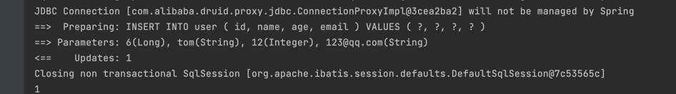

# 增删改查
::: tip 提示
本章节主要讲解运用MP通用增删改查。@123
:::

## 增
> 这里就提供了一个默认方法

---


```java
@SpringBootTest
public class InsertTest {

    @Autowired
    private UserMapper userMapper;

    @Test
    public void insert() {
        User user = new User();
        user.setAge(12);
        user.setId(6L);
        user.setName("tom");
        user.setEmail("123@qq.com");
        int insert = userMapper.insert(user);
        System.out.println(insert);
    }
}
```

## 删
> 有四个方法
> // 根据 entity 条件，删除记录
int delete(@Param(Constants.WRAPPER) Wrapper<T> wrapper);
// 删除（根据ID 批量删除）
int deleteBatchIds(@Param(Constants.COLLECTION) Collection<? extends Serializable> idList);
// 根据 ID 删除
int deleteById(Serializable id);
// 根据 columnMap 条件，删除记录
int deleteByMap(@Param(Constants.COLUMN_MAP) Map<String, Object> columnMap);

---

```java
@SpringBootTest
public class DeleteTest {

    @Autowired
    private UserMapper userMapper;

    /**
     * 根据 entity 条件，删除记录
     */
    @Test
    public void deleteByEntity() {
        // 创建一个 Wrapper 条件
        QueryWrapper<User> wrapper = Wrappers.query();
        // 设置删除条件，例如：id 等于6 的记录
        wrapper.eq("id", 6L);
        userMapper.delete(wrapper);
    }

    /**
     * 删除（根据ID 批量删除）
     */
    @Test
    public void deleteBatchIds() {
        userMapper.deleteBatchIds(Arrays.asList(1L, 2L));
    }

    /**
     * 根据 ID 删除
     */
    @Test
    public void deleteById() {
        userMapper.deleteById(3L);
    }

    /**
     * 根据 columnMap 条件，删除记录
     */
    @Test
    public void deleteByMap() {
        Map<String, Object> map = new HashMap<>();
        map.put("name", "Sandy");
        userMapper.deleteByMap(map);
    }
}
```

## 改
> 一共2个方法
> // 根据 whereWrapper 条件，更新记录
int update(@Param(Constants.ENTITY) T updateEntity, @Param(Constants.WRAPPER) Wrapper<T> whereWrapper);
// 根据 ID 修改
int updateById(@Param(Constants.ENTITY) T entity);


```java

@SpringBootTest
public class UpdateTest {

    @Autowired
    private UserMapper userMapper;

    /**
     * 根据 ID 修改
     */
    @Test
    public void updateById() {
        User user = new User();
        user.setAge(12);
        user.setId(6L);
        user.setName("tom");
        user.setEmail("123@qq.com");
        int insert = userMapper.updateById(user);
    }

    /**
     * 根据 whereWrapper 条件，更新记录
     */
    @Test
    public void update() {
        User user = new User();
        user.setAge(12);
        user.setId(6L);
        user.setName("tom");
        user.setEmail("123@qq.com");
        int insert = userMapper.insert(user);
        System.out.println(insert);
    }

}

```

## 查
> 一共10个方法
> 方法详情，参考[官方文档](https://baomidou.com/pages/49cc81/#select)

---

```java
@SpringBootTest
public class SelectTest {

    @Autowired
    private UserMapper userMapper;

    /**
     * 根据 ID 查询
     */
    @Test
    public void selectById() {
        User user = userMapper.selectById(1L);
        System.out.println(user);
    }

    /**
     *  根据 entity 条件，查询一条记录
     */
    @Test
    public void selectOne() {
        QueryWrapper<User> wrapper = Wrappers.query();
        wrapper.eq("id", 2L);
        User user = userMapper.selectOne(wrapper);
        System.out.println(user);
    }

    /**
     *  查询（根据ID 批量查询）
     */
    @Test
    public void selectBatchIds() {
        List<User> users = userMapper.selectBatchIds(Arrays.asList(1L, 2L));
        users.forEach(System.out::println);
    }

    /**
     *  根据 entity 条件，查询全部记录
     */
    @Test
    public void selectList() {
        QueryWrapper<User> wrapper = Wrappers.query();
        wrapper.gt("age", 18);
        List<User> users = userMapper.selectList(wrapper);
        users.forEach(System.out::println);
    }

    /**
     *  查询（根据 columnMap 条件）
     */
    @Test
    public void selectByMap() {
        Map<String, Object> map = new HashMap<>();
        map.put("id", 1l);
        List<User> users = userMapper.selectByMap(map);
        users.forEach(System.out::println);
    }

    /**
     *  根据 Wrapper 条件，查询全部记录
     *  selectList 和这个功能类似，但是selectList返回的是对象集合
     *  selectMaps返回的是将属性组织成map的key进行返回，需要根据需求进行选择
     */
    @Test
    public void selectMaps() {
        QueryWrapper<User> wrapper = Wrappers.query();
        wrapper.eq("id", 2L);
        List<Map<String, Object>> maps = userMapper.selectMaps(wrapper);
        maps.forEach(System.out::println);
    }

    /**
     *  根据 Wrapper 条件，查询全部记录。注意： 只返回第一个字段的值
     */
    @Test
    public void selectObjs() {
        QueryWrapper<User> wrapper = Wrappers.query();
        wrapper.eq("id", 2L);
        List<Object> objs = userMapper.selectObjs(wrapper);
        objs.forEach(System.out::println);
    }

    /**
     *  根据 entity 条件，查询全部记录（并翻页）
     */
    @Test
    public void selectPage() {
        QueryWrapper<User> wrapper = Wrappers.query();
        wrapper.gt("age", 18);
        Page<User> page = userMapper.selectPage(Page.of(1, 2), wrapper);
        page.getRecords().forEach(System.out::println);
    }

    /**
     *  根据 entity 条件，查询全部记录（并翻页）
     *  返回结果参考selectMaps的解释
     */
    @Test
    public void selectMapsPage() {
        QueryWrapper<User> wrapper = Wrappers.query();
        wrapper.gt("age", 18);
        Page<Map<String, Object>> page = userMapper.selectMapsPage(Page.of(1, 2), wrapper);
        page.getRecords().forEach(System.out::println);
    }

    /**
     *  根据 Wrapper 条件，查询总记录数
     */
    @Test
    public void selectCount() {
        QueryWrapper<User> wrapper = Wrappers.query();
        wrapper.gt("age", 18);
        Long count = userMapper.selectCount(wrapper);
        System.out.println(count);
    }
}
```

## 参考
[官方文档](https://baomidou.com/pages/49cc81/#select)
