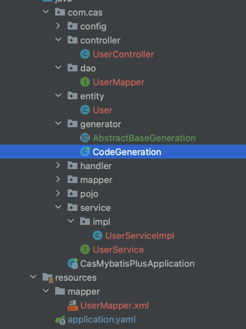

# mybatis-plus代码生成器使用
::: tip 提示
本章节主要讲解mybatis-plus代码生成器的使用，快速生成controller,service,dao等相关代码。@123
:::

## 代码生成器
>我这里采用的是MP3.5.4，如果有兼容问题，请留言告知具体版本，我这边会更新兼容的代码

---
### 依赖导入
>要使用代码生成，请导入以下包，完整包请见[springboot融合mybatis-plus的环境配置](mp-base-overview.md)
```
    implementation "com.baomidou:mybatis-plus-generator:3.5.4"
    implementation 'org.apache.velocity:velocity-engine-core:2.0'
```

### 代码
> AbstractBaseGeneration主要配置一些变量参数，CodeGeneration的Main是启动类
```java
package com.cas.generator;

/**
 * @description:
 * @author: xianglong
 * @create: 2024-02-29 10:02
 **/
public abstract class AbstractBaseGeneration {

    public static class DBconfig {
        protected static final String DATABASE = "cas";
        protected static final String URL = "jdbc:mysql://localhost:3306/" + DATABASE + "?&useSSL=true&useUnicode=true&characterEncoding=utf-8&serverTimezone=Asia/Shanghai";
        protected static final String TABLE_NAME = "user";
        protected static final String USERNAME = "root";
        protected static final String PASSWORD = "12345678";
    }

    public static class UserConfig {
        protected static final String AUTHOR = "xianglong";
    }
}

```

```java
package com.cas.generator;
 
import com.baomidou.mybatisplus.annotation.IdType;
import com.baomidou.mybatisplus.generator.FastAutoGenerator;
import com.baomidou.mybatisplus.generator.config.OutputFile;
import com.baomidou.mybatisplus.generator.config.rules.NamingStrategy;
 
import java.util.Collections;

import static com.cas.generator.AbstractBaseGeneration.DBconfig.PASSWORD;
import static com.cas.generator.AbstractBaseGeneration.DBconfig.TABLE_NAME;
import static com.cas.generator.AbstractBaseGeneration.DBconfig.URL;
import static com.cas.generator.AbstractBaseGeneration.DBconfig.USERNAME;
import static com.cas.generator.AbstractBaseGeneration.UserConfig.AUTHOR;

public class CodeGeneration extends AbstractBaseGeneration {

    public static void main(String[] args) {
        Generation();
    }

    /**
     * 根据表名生成相应结构代码
     */
    public static void Generation(){
        FastAutoGenerator.create(URL,USERNAME,PASSWORD)
                .globalConfig(builder -> builder.author(AUTHOR)
                        //启用swagger
                        .enableSwagger()
                        //指定输出目录
                        .outputDir(System.getProperty("user.dir")+"/src/main/java"))
                .packageConfig(builder -> builder.entity("entity")//实体类包名
                        .parent("com.cas")//父包名。如果为空，将下面子包名必须写全部， 否则就只需写子包名
                        .controller("controller")//控制层包名
                        .mapper("dao")//mapper层包名
                        //.other("dto")//生成dto目录 可不用
                        .service("service")//service层包名
                        .serviceImpl("service.impl")//service实现类包名
                        //自定义mapper.xml文件输出目录
                        .pathInfo(Collections.singletonMap(OutputFile.xml,System.getProperty("user.dir")+"/src/main/resources/mapper")))
                .strategyConfig(builder -> {
                    //设置要生成的表名
                    builder.addInclude(TABLE_NAME)
                            //.addTablePrefix("sys_")//设置表前缀过滤
                            .entityBuilder()
                            .enableLombok()
                            .enableChainModel()
                            .naming(NamingStrategy.underline_to_camel)//数据表映射实体命名策略：默认下划线转驼峰underline_to_camel
                            .columnNaming(NamingStrategy.underline_to_camel)//表字段映射实体属性命名规则：默认null，不指定按照naming执行
                            .idType(IdType.AUTO)//添加全局主键类型
                            .formatFileName("%s")//格式化实体名称，%s取消首字母I,
                            .mapperBuilder()
                            .enableMapperAnnotation()//开启mapper注解
                            .enableBaseResultMap()//启用xml文件中的BaseResultMap 生成
                            .enableBaseColumnList()//启用xml文件中的BaseColumnList
                            .formatMapperFileName("%sMapper")//格式化Dao类名称
                            .formatXmlFileName("%sMapper")//格式化xml文件名称
                            .serviceBuilder()
                            .formatServiceFileName("%sService")//格式化 service 接口文件名称
                            .formatServiceImplFileName("%sServiceImpl")//格式化 service 接口文件名称
                            .controllerBuilder()
                            .enableRestStyle();
                })
           .execute();
    }
}
```

### 效果
>运行上面的方法，会自动创建controller,dao,entity,service,resources/mapper层



### 总结
> 针对大部分项目，都可以通过自动生成简化代码，上40分钟敲5分钟不是梦。当然有些报表，多表查询还是需要在mapper.xml中来实现


### 参考
无