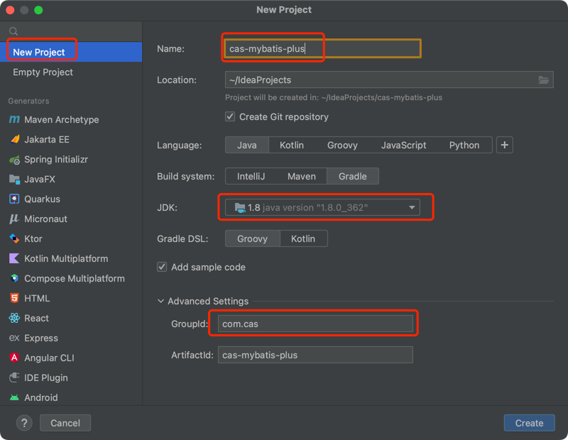
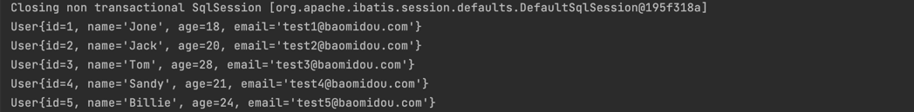

# ♥mybatis-plus知识体系详解♥
::: tip 提示
本章节主要讲解mybatis-plus和springboot的整合，并根据官网的介绍，探究mp的能力极限。@123
:::

### 环境配置

---
> 采用gradle构建项目，用如下配置，直接复制使用即可，或者clone[源码](https://github.com/xianglong123/cas-mybatis-plus/blob/master/src/test/java/com/cas/SampleTest.java)
```

plugins {
    id 'org.springframework.boot' version '2.2.1.RELEASE'
    id 'io.spring.dependency-management' version '1.0.11.RELEASE'
    id 'java'
    id 'io.freefair.lombok' version '5.0.0-rc6' apply false
}

ext {
    mybatisPlusVersion = '3.5.4'
}


group 'com.cas'
version '0.0.1-SNAPSHOT'

repositories {
    maven {
        url 'https://maven.aliyun.com/repository/public/'
    }
    mavenCentral()
}

dependencies {
    implementation 'com.alibaba:druid-spring-boot-starter:1.1.10'
    implementation 'mysql:mysql-connector-java:8.0.13'
    implementation "com.baomidou:mybatis-plus-boot-starter:${mybatisPlusVersion}"
    implementation "com.baomidou:mybatis-plus-generator:${mybatisPlusVersion}"
    implementation 'org.apache.velocity:velocity-engine-core:2.0'
    implementation 'org.springframework.boot:spring-boot-starter-web'
    implementation "org.projectlombok:lombok:1.18.12"
    testImplementation 'org.springframework.boot:spring-boot-starter-test'
}

test {
    useJUnitPlatform()
}

```
### hello-world
#### 项目构建
> 前言：通过官方的案例演示
1. 构建项目
   
2. 引入依赖 *依赖如上环境配置所示*
   

#### 数据库相关配置

---
application.yaml配置
```yaml
spring:
  datasource:
    username: root
    password: 12345678
    url: jdbc:mysql://localhost:3306/cas?useSSL=false&useUnicode=true&characterEncoding=UTF-8&autoReconnect=true&zeroDateTimeBehavior=convertToNull&allowMultiQueries=true
    driver-class-name: com.mysql.cj.jdbc.Driver
    type: com.alibaba.druid.pool.DruidDataSource
```
 创建表
```sql
DROP TABLE IF EXISTS `user`;

CREATE TABLE `user`
(
    id BIGINT NOT NULL COMMENT '主键ID',
    name VARCHAR(30) NULL DEFAULT NULL COMMENT '姓名',
    age INT NULL DEFAULT NULL COMMENT '年龄',
    email VARCHAR(50) NULL DEFAULT NULL COMMENT '邮箱',
    PRIMARY KEY (id)
);
```
其对应的数据库 Data 脚本如下
```sql
DELETE FROM `user`;

INSERT INTO `user` (id, name, age, email) VALUES
(1, 'Jone', 18, 'test1@baomidou.com'),
(2, 'Jack', 20, 'test2@baomidou.com'),
(3, 'Tom', 28, 'test3@baomidou.com'),
(4, 'Sandy', 21, 'test4@baomidou.com'),
(5, 'Billie', 24, 'test5@baomidou.com');
```

#### 测试用例

---
编写实体类 User.java（此处使用了 Lombok (opens new window)简化代码）
```java
@Data
@TableName("`user`")
public class User {
    private Long id;
    private String name;
    private Integer age;
    private String email;
}
```
编写 Mapper 包下的 UserMapper接口
```java
public interface UserMapper extends BaseMapper<User> {

}
```

#### 开始使用

---
添加测试类，进行功能测试：
```java
@RunWith(SpringRunner.class)
@SpringBootTest
public class SampleTest {

   @Autowired
   private UserMapper userMapper;

   /**
    * mybatis-plus查询操作【单表】
    */
   @Test
   public void testSelect() {
      System.out.println(("----- selectAll method test ------"));
      List<User> userList = userMapper.selectList(null);
      userList.forEach(System.out::println);
   }
}
```

测试结果


#### 结论

---
> 通过对简单案例的使用，mp确实在对单表的操作上很便捷，无需构建xml文件，到这里其实还是需要写一些固化的代码，我们使用生成器来简化这一过程
> 请转到[代码生成器](mp-generator-new.md)

### 参考
[源码](https://github.com/xianglong123/cas-mybatis-plus/blob/master/src/test/java/com/cas/SampleTest.java)

[官方案例](https://baomidou.com/pages/226c21/#%E5%BC%80%E5%A7%8B%E4%BD%BF%E7%94%A8)