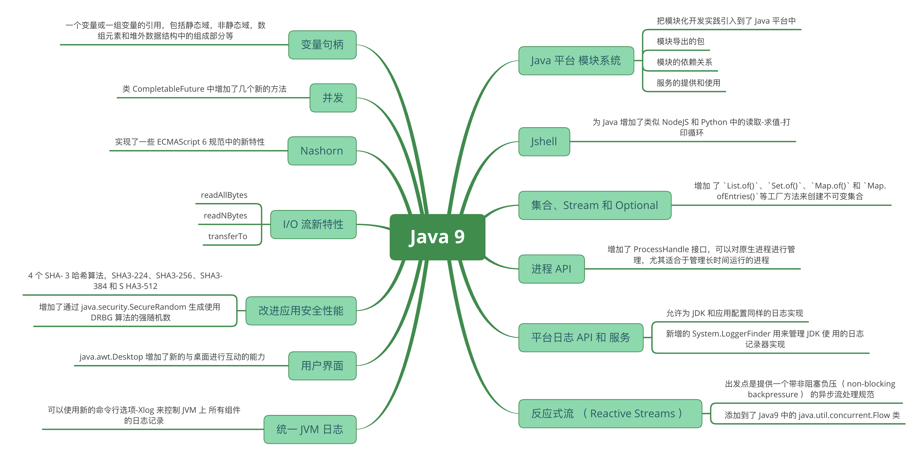
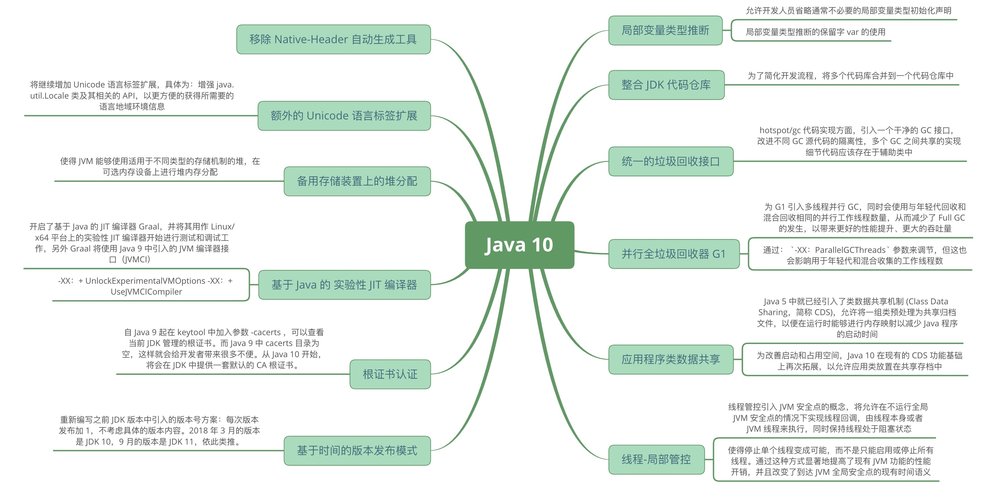
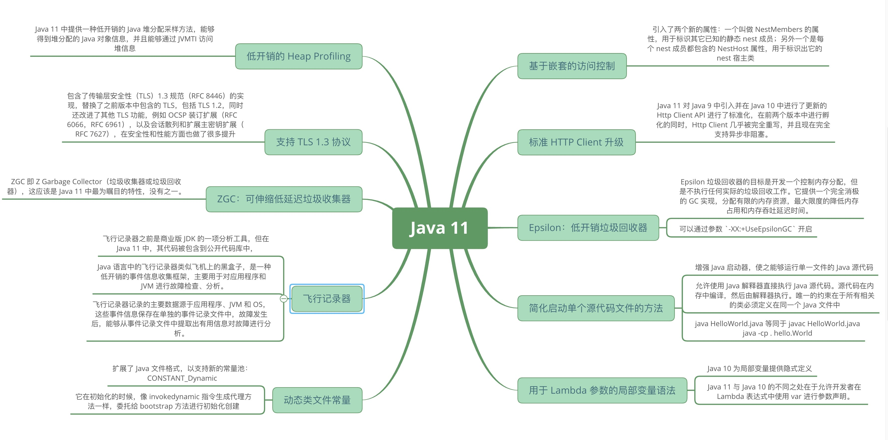
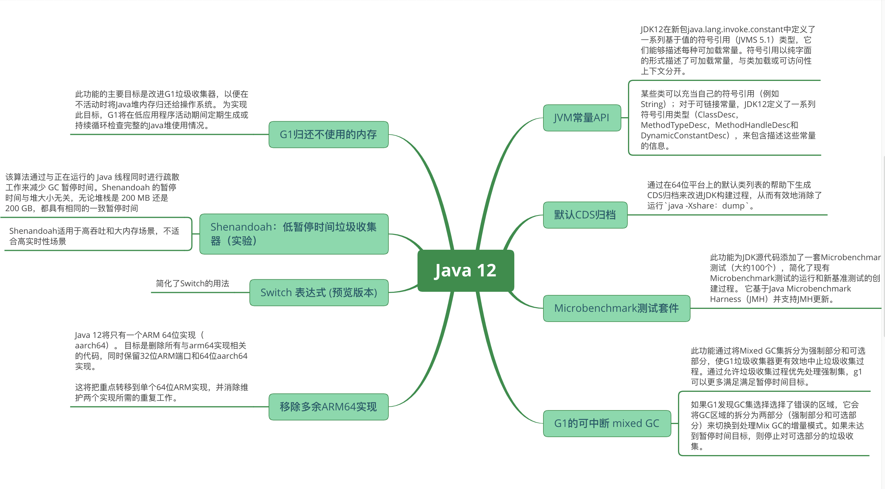
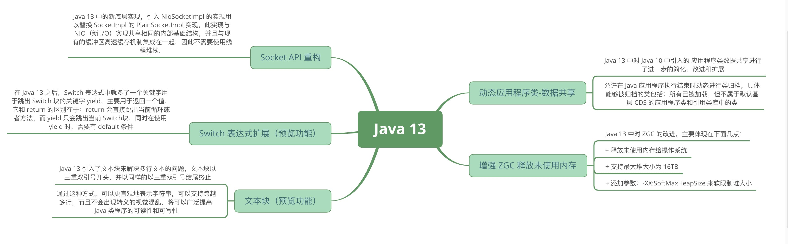
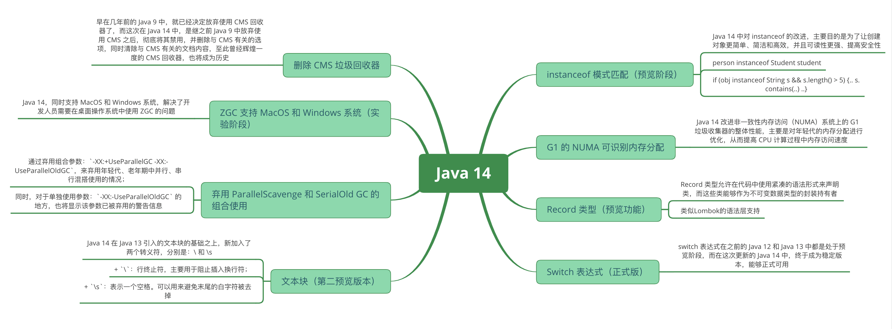
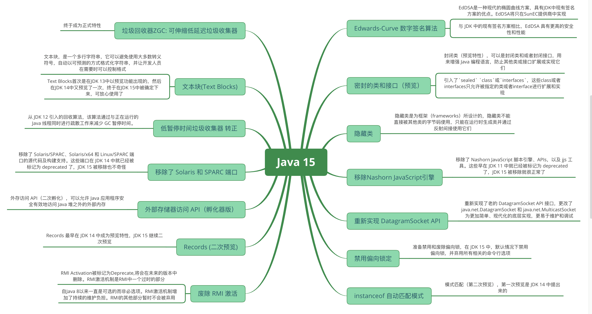
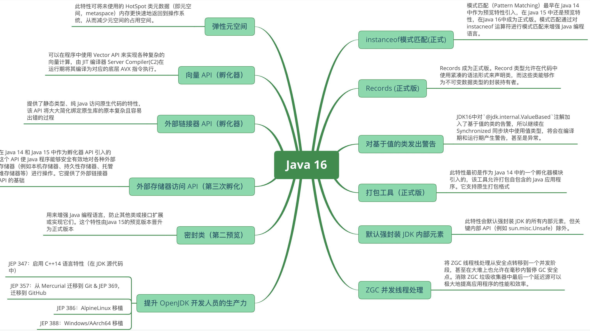
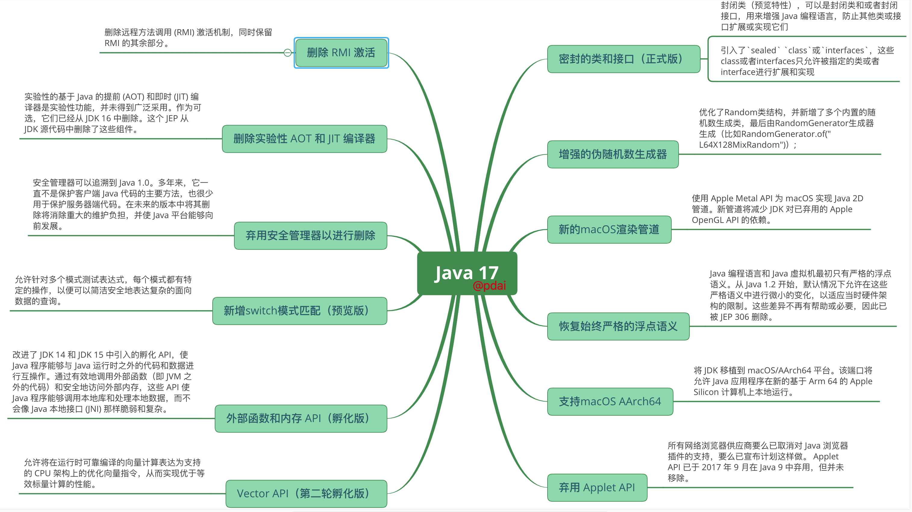

# ♥Java8+特性知识体系详解♥

::: tip 提示
本系列主要介绍Java8以上所有版本特性知识体系详解。 @123

:::

*   ♥Java8+特性知识体系详解♥
    *   重点知识
    *   版本详解
        *   Java 8 升Java 11
        *   Java 11 升Java 17
        *   Java 9 新特性详解
        *   Java 10 新特性概述
        *   Java 11 新特性概述
        *   Java 12 新特性概述
        *   Java 13 新特性概述
        *   Java 14 新特性概述
        *   Java 15 新特性概述
        *   Java 16 新特性概述
        *   Java 17 新特性概述

### # 重点知识

> > Java现在发布的版本很快，每年两个，但是真正会被大规模使用的是三年一个的TLS版本。@pdai

*   每3年发布一个TLS，长期维护版本。意味着Java 8 ，Java 11， Java 17 才可能被大规模使用。
*   每年发布两个正式版本，分别是3月份和9月份。

### # 版本详解

### # Java 8 升Java 11

> > Java 11 在 2018 年 9 月 25 日正式发布！根据发布的规划，JDK 11 是一个长期维护的版本（LTS); 本文帮助你梳理Java 8 升Java 11 重要特性。

> Java 8 升Java 11 重要特性必读

### # Java 11 升Java 17

> > JDK 17 在 2021 年 9 月 14 号正式发布了！根据发布的规划，这次发布的 JDK 17 是一个长期维护的版本（LTS)。SpingFramework 6 和SpringBoot 3中默认将使用JDK 17，所以JDK 17必将是使用较广泛的版本; 而从上个LTS版本JDK11到JDK17有哪些重要特性需要掌握呢？本文帮助你梳理Java 11 升Java 17 重要特性。

> Java 11 升Java 17 重要特性必读

### # Java 9 新特性详解

> > Java 9 正式发布于 2017 年 9 月 21 日。作为 Java8 之后 3 年半才发布的新版本，Java 9 带来了很多重大的变化。其中最重要的改动是 Java 平台模块系统的引入。除此之外，还有一些新的特性。本文对 Java9 中包含的新特性做了概括性的介绍，可以帮助你快速了解 Java 9。

> _知识体系系统性梳理_

> 

> _相关文章_

*   Java 9 新特性概述
    *   Java 平台 模块系统
    *   Jshell
    *   集合、Stream 和 Optional
    *   进程 API
    *   平台日志 API 和 服务
    *   反应式流 （ Reactive Streams ）
    *   变量句柄
    *   并发
    *   Nashorn
    *   I/O 流新特性
    *   改进应用安全性能
    *   用户界面
    *   统一 JVM 日志
    *   其他改动方面
    *   结束语
    *   参考文章

* * *

### # Java 10 新特性概述

> > 作为当今使用最广泛的编程语言之一的 Java 在 2018 年 3 月 21 日发布了第十个大版本。为了更快地迭代、更好地跟进社区反馈，Java 语言版本发布周期调整为每隔 6 个月发布一次。Java 10 是这一新规则之后，采用新发布周期的第一个大版本。Java 10 版本带来了很多新特性，其中最备受广大开发者关注的莫过于局部变量类型推断。除此之外，还有其他包括垃圾收集器改善、GC 改进、性能提升、线程管控等一批新特性。本文主要针对 Java 10 中的新特性展开介绍，希望读者能从本文的介绍中快速了解 Java 10 带来的变化。

> _知识体系系统性梳理_

> 

> _相关文章_

*   Java 10 新特性概述
    *   局部变量类型推断
    *   整合 JDK 代码仓库
    *   统一的垃圾回收接口
    *   并行全垃圾回收器 G1
    *   应用程序类数据共享
    *   线程-局部管控
    *   移除 Native-Header 自动生成工具
    *   额外的 Unicode 语言标签扩展
    *   备用存储装置上的堆分配
    *   基于 Java 的 实验性 JIT 编译器
    *   根证书认证
    *   基于时间的版本发布模式
    *   结束语
    *   参考文章

### # Java 11 新特性概述

> > Java 11 已于 2018 年 9 月 25 日正式发布，之前在 Java 10 新特性介绍 中介绍过，为了加快的版本迭代、跟进社区反馈，Java 的版本发布周期调整为每六个月一次——即每半年发布一个大版本，每个季度发布一个中间特性版本，并且做出不会跳票的承诺。通过这样的方式，Java 开发团队能够将一些重要特性尽早的合并到 Java Release 版本中，以便快速得到开发者的反馈，避免出现类似 Java 9 发布时的两次延期的情况。

> _知识体系系统性梳理_

> 

> _相关文章_

*   Java 11 新特性概述
    *   基于嵌套的访问控制
    *   标准 HTTP Client 升级
    *   Epsilon：低开销垃圾回收器
    *   简化启动单个源代码文件的方法
    *   用于 Lambda 参数的局部变量语法
    *   低开销的 Heap Profiling
    *   支持 TLS 1.3 协议
    *   ZGC：可伸缩低延迟垃圾收集器
    *   飞行记录器
    *   动态类文件常量
    *   结束语
    *   参考文章

* * *

### # Java 12 新特性概述

> > JDK12 在 2019 年 3 月 19 号正式发布，不同于JDK11，JDK12并不是一个LTS版本。作为一个中间版本，JDK12版本特性增加较少。 2017年宣布的加速发布节奏要求每六个月发布一次功能，每季度更新一次，每三年发布一次长期支持（LTS）更新版本（或每六个版本一次）

> _知识体系系统性梳理_

> 

> _相关文章_

*   Java 12 新特性概述
    *   新功能和库的更新
        *   JEP334: JVM常量API
        *   JEP341: 默认CDS归档
        *   JEP230: Microbenchmark测试套件
    *   新的平台支持
        *   JEP340: 移除多余ARM64实现
    *   JVM 优化
        *   JPE 344: G1的可中断 mixed GC
        *   JEP 346: G1归还不使用的内存
    *   新功能的预览和实验
        *   JEP 189: Shenandoah：低暂停时间垃圾收集器（实验）
        *   JEP 325: Switch 表达式 (预览版本)

### # Java 13 新特性概述

> > Java 13 已如期于 9 月 17 日正式发布，此次更新是继半年前 Java 12 这大版本发布之后的一次常规版本更新，在这一版中，主要带来了 ZGC 增强、更新 Socket 实现、Switch 表达式更新等方面的改动、增强。本文主要针对 Java 13 中主要的新特性展开介绍，带你快速了解 Java 13 带来的不同体验。

> _知识体系系统性梳理_

> 

> _相关文章_

*   Java 13 新特性概述
    *   新功能和库的更新
        *   JEP350: 动态应用程序类-数据共享
        *   JEP353: Socket API 重构
    *   JVM 优化
        *   JEP351: 增强 ZGC 释放未使用内存
    *   新功能预览
        *   JEP354: Switch 表达式扩展（预览功能）
        *   JEP355: 文本块（预览功能）

* * *

### # Java 14 新特性概述

> > Java 14 已如期于 2020 年 3 月 17 日正式发布，此次更新是继半年前 Java 13 这大版本发布之后的又一次常规版本更新，即便在全球疫情如此严峻形势下，依然保持每六个月的版本更新频率，为大家及时带来改进和增强，这一点值得点赞。在这一版中，主要带来了 ZGC 增强、instanceof 增强、Switch 表达式更新为标准版等方面的改动、增强和新功能。本文主要介绍 Java 14 中的主要新特性，带您快速了解 Java 14 带来了哪些不一样的体验和便利。

> _知识体系系统性梳理_

> 

> _相关文章_

*   Java 14 新特性概述
    *   语言特性增强
        *   JEP 359: Switch 表达式（正式版）
    *   新功能和库的更新
        *   JEP 358: 改进 NullPointerExceptions 提示信息
    *   旧功能的删除和弃用
        *   JEP 367: 删除 pack200 和 unpack200 工具
    *   JVM 相关
        *   JEP 345: G1 的 NUMA 可识别内存分配
        *   JEP 363: 删除 CMS 垃圾回收器
        *   JEP 364&365: ZGC 支持 MacOS 和 Windows 系统（实验阶段）
        *   JEP 366: 弃用 ParallelScavenge 和 SerialOld GC 的组合使用
    *   新功能的预览和实验
        *   JEP 305: instanceof 模式匹配（预览阶段）
        *   JEP 359: Record 类型（预览功能）
        *   JEP 368: 文本块（第二预览版本）
        *   JEP 343: 打包工具（孵化器版本）
        *   JEP 370: 外部存储器访问 API（孵化器版）

* * *

### # Java 15 新特性概述

> > JDK 15 在 2020 年 9 月 15 号正式发布了！根据发布的规划，这次发布的 JDK 15 将是一个短期的过度版，只会被 Oracle 支持（维护）6 个月，直到明年 3 月的 JDK 16 发布此版本将停止维护。而 Oracle 下一个长期支持版（LTS 版）会在明年的 9 月份候发布（Java 17），LTS 版每 3 年发布一个，上一次长期支持版是 18 年 9 月发布的 JDK 11。

> _知识体系系统性梳理_

> 

> _相关文章_

*   Java 15 新特性概述
    *   语言特性增强
        *   JEP 378: 文本块(Text Blocks)
    *   新功能和库的更新
        *   JEP 339: Edwards-Curve 数字签名算法 (EdDSA)
        *   JEP 371: 隐藏类 Hidden Classes
        *   JEP 373: 重新实现 DatagramSocket API
    *   JVM 优化
        *   JEP 373: ZGC: 可伸缩低延迟垃圾收集器
        *   JEP 374: 禁用偏向锁定
        *   JEP 379: Shenandoah：低暂停时间垃圾收集器(转正)
    *   旧功能的删除和弃用
        *   JEP 372: 移除Nashorn JavaScript引擎
        *   JEP 381: 移除了 Solaris 和 SPARC 端口。
        *   JEP 385: 废除 RMI 激活
    *   新功能的预览和孵化
        *   JEP 375: instanceof 自动匹配模式（第二次预览）
        *   JEP 360: 密封的类和接口（预览）
        *   JEP 383: 外部存储器访问 API（二次孵化器版）
        *   JEP 384: Records (二次预览)

* * *

### # Java 16 新特性概述

> > JDK 16 在 2021 年 3 月 16 号发布！根据发布的规划，这次发布的 JDK 17 是一个长期维护的版本（LTS)。Java 16 提供了数千个`性能`、`稳定性`和`安全性`更新，以及 `17 个 JEP`（JDK 增强提案），进一步改进了 Java 语言和平台，以帮助开发人员提高工作效率。

> _知识体系系统性梳理_

> 

> _相关文章_

*   Java 16 新特性概述
    *   语言特性增强
        *   JEP 394: instanceof 模式匹配（正式版）
        *   JEP 395: Records (正式版)
    *   新工具和库
        *   JEP 380：Unix-Domain 套接字通道
        *   JEP 390: 对基于值的类发出警告
        *   JEP 392：打包工具（正式版）
        *   JEP 396：默认强封装 JDK 内部元素
    *   JVM 优化
        *   JEP 376：ZGC 并发线程处理
        *   JEP 387：弹性元空间
    *   新功能的预览和孵化
        *   JEP 338：向量 API（孵化器）
        *   JEP 389：外部链接器 API（孵化器）
        *   JEP 393：外部存储器访问 API（第三次孵化）
        *   JEP 397：密封类（第二预览）
    *   提升 OpenJDK 开发人员的生产力
        *   JEP 347：启用 C++14 语言特性（在 JDK 源代码中）
        *   JEP 357：从 Mercurial 迁移到 Git & JEP 369，迁移到 GitHub
        *   JEP 386：AlpineLinux 移植 & JEP 388：Windows/AArch64 移植

* * *

### # Java 17 新特性概述

> > JDK 17 在 2021 年 9 月 14 号正式发布了！根据发布的规划，这次发布的 JDK 17 是一个长期维护的版本（LTS)。Java 17 提供了数千个`性能`、`稳定性`和`安全性`更新，以及 `14 个 JEP`（JDK 增强提案），进一步改进了 Java 语言和平台，以帮助开发人员提高工作效率。JDK 17 包括新的语言增强、库更新、对新 Apple (Mx CPU)计算机的支持、旧功能的删除和弃用，并努力确保今天编写的 Java 代码在未来的 JDK 版本中继续工作而不会发生变化。它还提供语言功能预览和孵化 API，以收集 Java 社区的反馈。@pdai

> _知识体系系统性梳理_

> 

> _相关文章_

*   Java 17 新特性概述
    *   知识体系
    *   语言特性增强
        *   密封的类和接口（正式版）
    *   工具库的更新
        *   JEP 306：恢复始终严格的浮点语义
        *   JEP 356：增强的伪随机数生成器
            *   `JDK 17之前如何生成随机数`？
            *   `为什么需要增强`？
            *   `增强后是什么样的`？
        *   JEP 382：新的macOS渲染管道
    *   新的平台支持
        *   JEP 391：支持macOS AArch64
    *   旧功能的删除和弃用
        *   JEP 398：弃用 Applet API
        *   JEP 407：删除 RMI 激活
        *   JEP 410：删除实验性 AOT 和 JIT 编译器
        *   JEP 411：弃用安全管理器以进行删除
    *   新功能的预览和孵化API
        *   JEP 406：新增switch模式匹配（预览版）
        *   JEP 412：外部函数和内存api （第一轮孵化）
        *   JEP 414：Vector API（第二轮孵化）
        *   JEP 389：外部链接器 API（孵化器）

* * *
