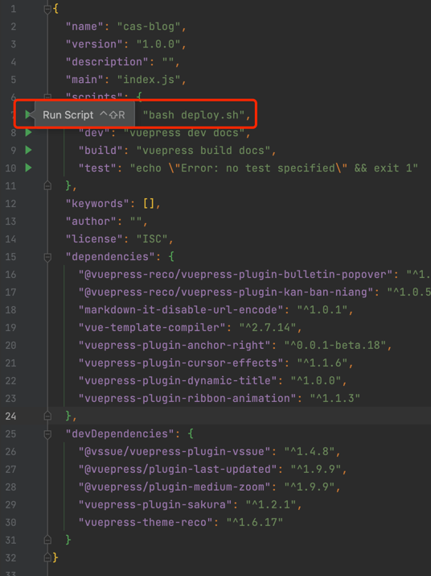
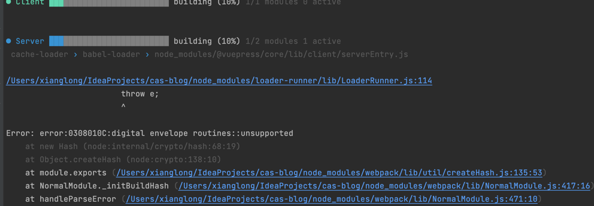
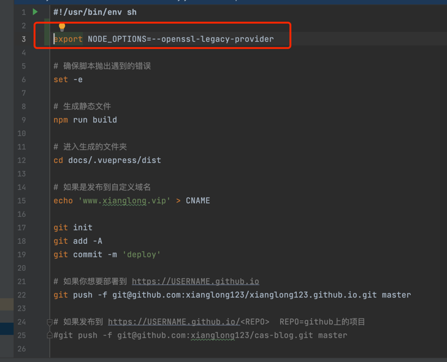

::: tip 提示
这个问题是因为我想重启博客，然后准备构建项目上传到github.io项目上，但是构建过程中报错了，记录一下。@123
:::

### 过程

---
>运行deploy.sh脚本

>报错

### 解决方案

---
>在脚本里面加入 *export NODE_OPTIONS=--openssl-legacy-provider*,再运行脚本即可，异常原因见[简书-嘿咿呀](https://www.jianshu.com/p/fc7674e8a84d)

### 参考
[简书-嘿咿呀](https://www.jianshu.com/p/fc7674e8a84d)