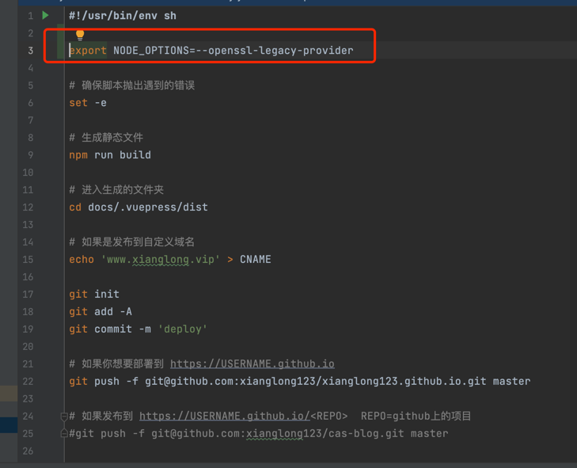

::: tip 提示
这个问题是因为我想重启博客，然后准备构建项目上传到github.io项目上，但是构建过程中报错了，记录一下。@123
:::

### 过程

---
运行deploy.sh脚本

报错

### 解决方案

---
> error:0308010C:digital envelope routines::unsupported
出现这个错误是因为 node.js V17版本中最近发布的OpenSSL3.0, 而OpenSSL3.0对允许算法和密钥大小增加了严格的限制，可能会对生态系统造成一些影响.
> 
>在node.js V17以前一些可以正常运行的的应用程序,但是在 V17 版本可能会抛出以下异常:

在脚本里面加入 *export NODE_OPTIONS=--openssl-legacy-provider*

### 参考
[简书-嘿咿呀](https://www.jianshu.com/p/fc7674e8a84d)